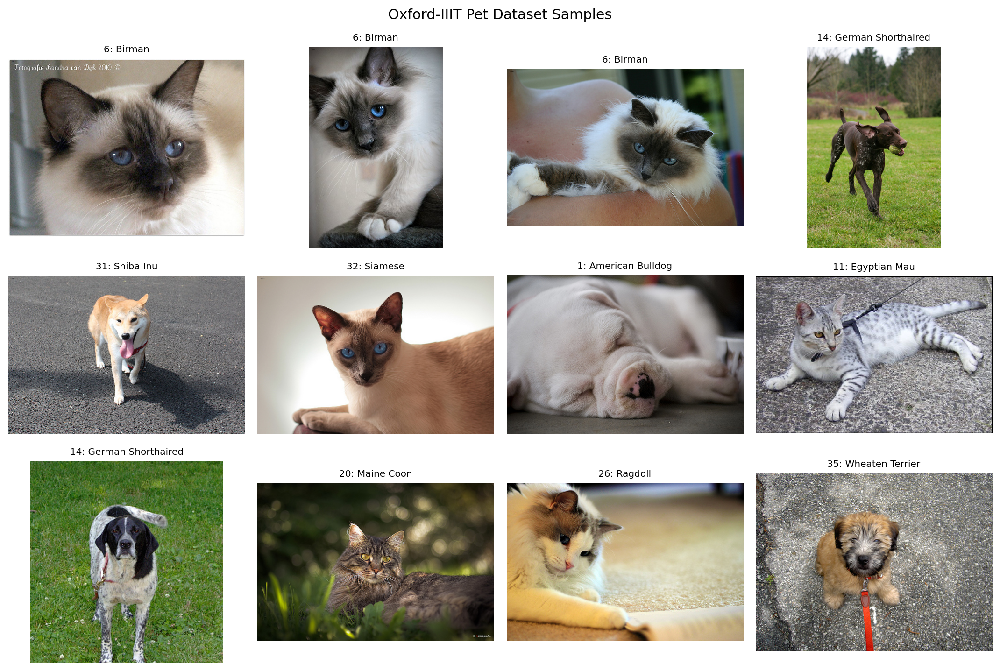
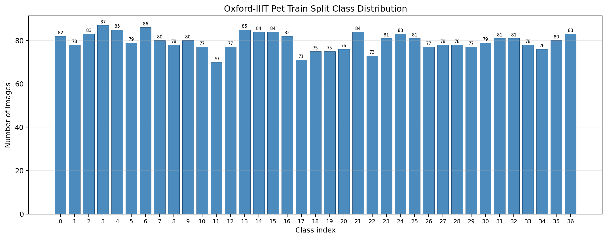
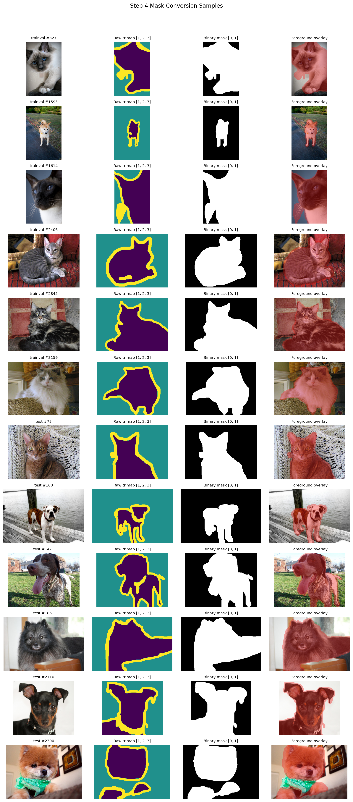
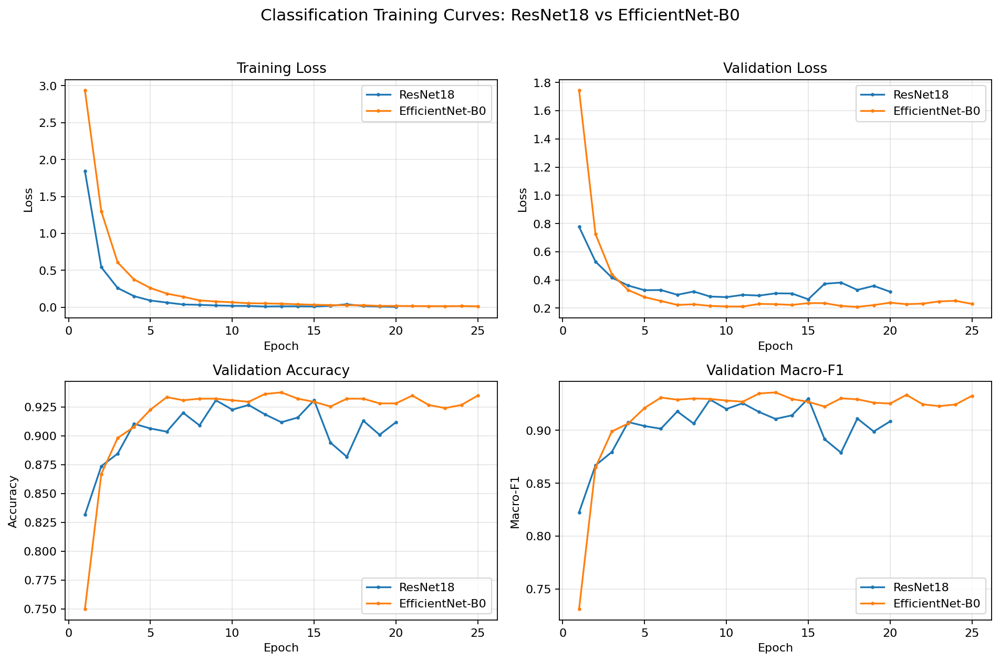
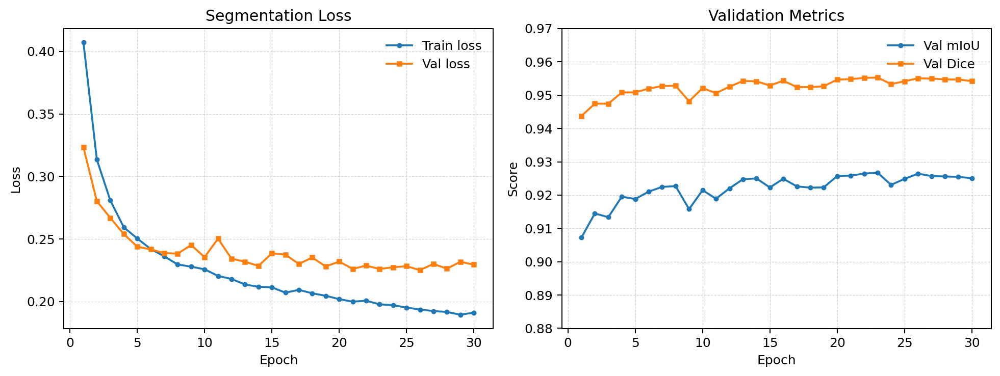
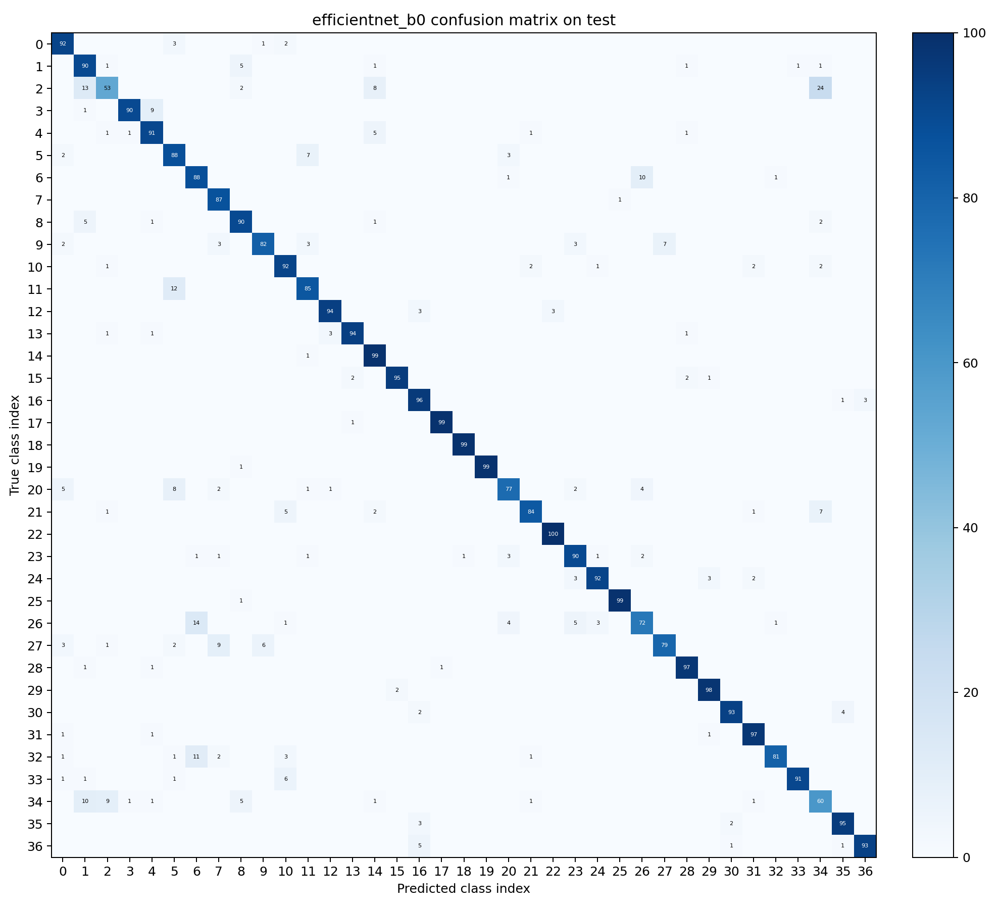
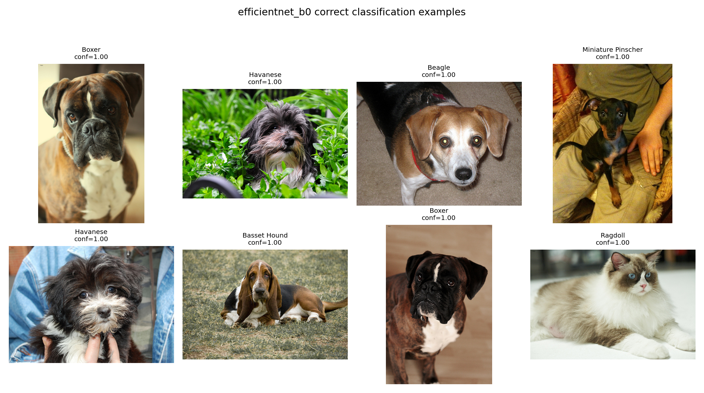
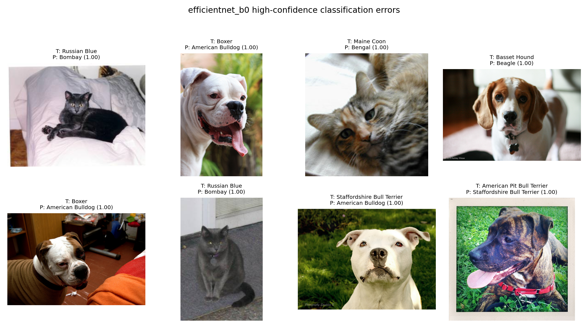
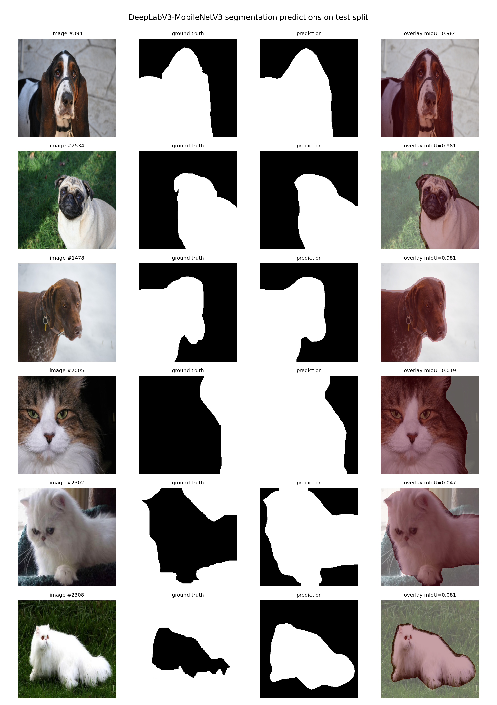

# 五、实验过程原始记录

本节对实验过程中形成的主要原始记录进行整理，包括数据划分记录、预处理检查结果、训练日志、测试指标和可视化图表等内容。相关文件统一保存在项目的 `outputs/` 目录下，其中 `outputs/logs/` 用于保存训练过程日志，`outputs/results/` 用于保存数据统计、指标计算和逐样本预测结果，`outputs/figures/` 用于保存数据样例、训练曲线、混淆矩阵和分割结果图，`outputs/checkpoints/` 用于保存训练过程中得到的最佳模型权重。通过这些记录，可以对实验过程和最终结果进行复查。

## 5.1 数据样例与类别分布记录

本实验使用 Oxford-IIIT Pet 数据集作为实验对象。该数据集包含 37 类宠物品种图像，同时提供品种分类标签和 trimap 分割标注，能够同时支持图像分类和前景分割两个任务。实验中使用固定随机种子 42 对官方 `trainval` 部分进行训练集和验证集划分，官方 `test` 部分保持独立，只在最终测试阶段使用。

具体数据划分情况见表 5-1。划分索引已保存到 `outputs/results/split_indices_seed42.json`，后续分类训练、分割训练和模型评估均复用这一划分方式，从而保证不同实验之间的数据来源一致。

| 划分 | 样本数 | 用途 |
| --- | ---: | --- |
| 官方 trainval | 3680 | 原始训练验证数据 |
| train | 2944 | 模型训练 |
| val | 736 | 训练过程验证和最佳模型选择 |
| test | 3669 | 最终测试评估 |

图 5-1 展示了数据集中不同宠物品种的图像样例。从样例可以看到，宠物图像在姿态、背景、拍摄距离和光照条件上差异较大；同时，部分猫狗品种在毛色、脸部结构和体型上较为相似，因此本实验中的分类任务具有一定的细粒度识别难度。

图 5-2 展示了训练集中的类别分布情况。Oxford-IIIT Pet 数据集整体上较为均衡，但在固定随机划分后，不同类别在训练集和验证集中的样本数量仍会存在小幅波动。因此，在分类任务中，除整体 Accuracy 外，本实验还记录 Macro-F1，以便观察模型在各类别上的平均表现。

本部分原始记录文件如下：

| 记录内容 | 文件路径 |
| --- | --- |
| 数据集统计摘要 | `outputs/results/data_summary.json` |
| 类别分布 CSV | `outputs/results/class_distribution.csv` |
| 固定划分索引 | `outputs/results/split_indices_seed42.json` |
| 数据样例图 | `outputs/figures/fig_dataset_samples.png` |
| 类别分布图 | `outputs/figures/fig_class_distribution.png` |

## 5.2 Mask 转换与预处理检查记录

Oxford-IIIT Pet 数据集提供的 trimap 标注包含 3 种像素值：`1` 表示宠物前景，`2` 表示背景，`3` 表示边界区域。由于本实验的分割目标是区分宠物前景和背景，因此需要先将原始 trimap 转换为二值 mask。具体做法是将原始像素值 `2` 映射为背景 `0`，将原始像素值 `1` 和 `3` 映射为前景 `1`。

该转换规则见表 5-2。转换完成后，分割模型只需要预测背景和前景两类，后续计算背景 IoU、前景 IoU、mIoU 和 Dice 时也均以该二值 mask 作为标签依据。

| 原始 trimap 值 | 原始含义 | 二值 mask 值 | 二值含义 |
| ---: | --- | ---: | --- |
| 1 | 宠物前景 | 1 | 前景 |
| 2 | 背景 | 0 | 背景 |
| 3 | 边界区域 | 1 | 前景 |

图 5-3 展示了原始图像、原始 trimap 和二值 mask 的对比样例。通过该图可以检查 mask 转换是否正确，也可以直观观察边界像素并入前景后形成的标注区域。

分类任务和分割任务使用不同的输入尺寸。分类模型输入尺寸为 `224 x 224`，分割模型输入尺寸为 `320 x 320`。在分割任务中，图像 resize 使用普通图像插值方式，mask resize 使用最近邻插值，以避免离散类别标签在缩放过程中产生非法像素值。训练阶段的随机裁剪和水平翻转也对图像和 mask 同步执行，从而保证像素级标签与图像内容保持对齐。

本部分原始记录文件如下：

| 记录内容 | 文件路径 |
| --- | --- |
| trimap 转换规则 | `outputs/results/trimap_rule_step4.json` |
| mask 转换抽查记录 | `outputs/results/mask_conversion_check.json` |
| 数据预处理检查记录 | `outputs/results/preprocessing_check.json` |
| DataLoader 检查记录 | `outputs/results/dataloader_check.json` |
| mask 样例图 | `outputs/figures/fig_mask_samples.png` |
| 预处理检查图 | `outputs/figures/fig_preprocessing_check.png` |

## 5.3 训练过程记录

本实验共完成三个核心训练实验，分别为 ResNet18 分类 baseline、EfficientNet-B0 分类主模型和 DeepLabV3-MobileNetV3 前景分割模型。三个实验均使用固定数据划分和固定随机种子，训练过程中的主要指标以 CSV 文件形式保存，便于后续绘制曲线和复核结果。

训练过程概况见表 5-3。分类模型以验证集 Macro-F1 作为主要模型选择依据，分割模型以验证集 mIoU 作为主要模型选择依据，并在验证指标最优时保存对应权重。

| 实验编号 | 任务 | 模型 | 输入尺寸 | 训练 epoch | 最佳 epoch | 训练日志 |
| --- | --- | --- | ---: | ---: | ---: | --- |
| Exp-1 | 分类 | ResNet18 | 224 | 20 | 15 | `outputs/logs/resnet18_cls_log.csv` |
| Exp-2 | 分类 | EfficientNet-B0 | 224 | 25 | 13 | `outputs/logs/efficientnet_b0_cls_log.csv` |
| Exp-3 | 分割 | DeepLabV3-MobileNetV3 | 320 | 30 | 23 | `outputs/logs/deeplabv3_mobilenet_seg_log.csv` |

图 5-4 展示了 ResNet18 和 EfficientNet-B0 的分类训练曲线。训练日志中记录了每个 epoch 的训练损失、验证损失、验证 Accuracy、验证 Macro-F1、学习率和耗时。从曲线变化可以看出，两个分类模型在训练过程中整体能够逐步提升验证指标，没有出现明显的 loss 发散现象，说明训练过程基本稳定。

图 5-5 展示了 DeepLabV3-MobileNetV3 的分割训练曲线。分割训练日志记录了训练损失、验证损失、Pixel Accuracy、背景 IoU、前景 IoU、mIoU 和 Dice 等指标。根据训练记录，最佳验证 mIoU 出现在第 23 个 epoch，对应权重保存为 `outputs/checkpoints/best_seg_deeplabv3_mobilenet.pth`。

本部分原始记录文件如下：

| 任务 | 记录类型 | 文件路径 |
| --- | --- | --- |
| ResNet18 分类 | 训练日志 | `outputs/logs/resnet18_cls_log.csv` |
| ResNet18 分类 | 最佳权重 | `outputs/checkpoints/best_cls_resnet18.pth` |
| EfficientNet-B0 分类 | 训练日志 | `outputs/logs/efficientnet_b0_cls_log.csv` |
| EfficientNet-B0 分类 | 最佳权重 | `outputs/checkpoints/best_cls_efficientnet_b0.pth` |
| DeepLabV3-MobileNetV3 分割 | 训练日志 | `outputs/logs/deeplabv3_mobilenet_seg_log.csv` |
| DeepLabV3-MobileNetV3 分割 | 最佳权重 | `outputs/checkpoints/best_seg_deeplabv3_mobilenet.pth` |

## 5.4 测试数据与计算结果记录

模型训练完成后，本实验在官方测试集上分别评估两个分类模型和一个分割模型。测试集共包含 3669 张图像，只用于最终评估，不参与训练过程和最佳模型选择。

分类任务的测试结果见表 5-4。ResNet18 在测试集上的 Accuracy 为 `0.883074`，Macro-F1 为 `0.881759`；EfficientNet-B0 在测试集上的 Accuracy 为 `0.899700`，Macro-F1 为 `0.898173`。两个模型的 Top-5 Accuracy 均高于 `0.98`，说明在多数情况下，真实类别能够出现在模型预测概率最高的前几个候选类别中。

| 模型 | Accuracy | Macro-F1 | Weighted-F1 | Top-5 Accuracy | Test Loss |
| --- | ---: | ---: | ---: | ---: | ---: |
| ResNet18 | 0.883074 | 0.881759 | 0.882539 | 0.986645 | 0.418459 |
| EfficientNet-B0 | 0.899700 | 0.898173 | 0.898878 | 0.995639 | 0.344536 |

上述分类测试指标来自 `outputs/results/cls_ablation_test_summary.csv`。逐样本预测结果分别保存为 `outputs/results/cls_predictions_resnet18_test.csv` 和 `outputs/results/cls_predictions_efficientnet_b0_test.csv`，可用于进一步查看每张测试图像的真实类别、预测类别和预测置信度。

图 5-6 为 EfficientNet-B0 在测试集上的混淆矩阵。该图记录了 37 类宠物品种之间的预测分布情况，可用于观察哪些类别更容易被模型混淆，并为后续结果分析提供依据。

分割任务的测试结果见表 5-5。DeepLabV3-MobileNetV3 在测试集上的 Pixel Accuracy 为 `0.961981`，前景 IoU 为 `0.913212`，mIoU 为 `0.924921`，Dice 为 `0.954638`。这些结果来自 `outputs/results/seg_metrics_deeplabv3_mobilenet.json` 和 `outputs/results/seg_summary_deeplabv3_mobilenet_test.csv`。

| 模型 | Pixel Accuracy | Background IoU | Foreground IoU | mIoU | Dice | Test Loss |
| --- | ---: | ---: | ---: | ---: | ---: | ---: |
| DeepLabV3-MobileNetV3 | 0.961981 | 0.936630 | 0.913212 | 0.924921 | 0.954638 | 0.116487 |

在分割评估过程中，程序还记录了有效像素数、背景/前景交并集、预测前景像素数和真实前景像素数等中间计算量。这些数值保存在 `outputs/results/seg_metrics_deeplabv3_mobilenet.json` 中，可用于复查 mIoU 和 Dice 等指标的计算过程。

## 5.5 模型输出样例记录

除数值指标外，本实验还生成了分类和分割任务的可视化输出，用于更直观地观察模型预测效果。

图 5-7 展示了 EfficientNet-B0 在测试集上的部分分类正确样例。样例中包含不同品种、不同背景和不同姿态的宠物图像，可以反映模型在常规样本上的识别情况。

图 5-8 展示了 EfficientNet-B0 的部分高置信度分类错误样例。这些样例主要作为后续错误分析的原始材料，具体错误原因可在第六节中结合品种外观相似性、拍摄角度和背景干扰等因素进一步讨论。

图 5-9 展示了 DeepLabV3-MobileNetV3 在测试集上的分割预测对比，包括原图、真实 mask 和预测 mask。通过该图可以观察模型对宠物主体区域的定位效果，也可以看到模型在边界、遮挡、浅色背景等情况下可能出现的预测差异。

本部分原始记录文件如下：

| 记录内容 | 文件路径 |
| --- | --- |
| EfficientNet-B0 分类样例记录 | `outputs/results/cls_examples_efficientnet_b0.json` |
| EfficientNet-B0 测试集逐样本预测 | `outputs/results/cls_predictions_efficientnet_b0_test.csv` |
| ResNet18 测试集逐样本预测 | `outputs/results/cls_predictions_resnet18_test.csv` |
| 分割测试集逐样本预测 | `outputs/results/seg_predictions_deeplabv3_mobilenet_test.csv` |
| 分割可视化样例记录 | `outputs/results/seg_visualized_samples.json` |
| 分割困难样例分析记录 | `outputs/results/seg_failure_analysis_step10.md` |

## 5.6 实验记录索引

为便于复核实验过程，表 5-6 汇总了本实验中较为重要的原始记录文件。这些文件覆盖了数据划分、模型训练、测试指标、逐样本预测和可视化结果等内容，可以作为后续报告分析和实验复现的依据。

| 类别 | 记录内容 | 文件路径 |
| --- | --- | --- |
| 数据 | 数据集统计摘要 | `outputs/results/data_summary.json` |
| 数据 | 固定划分索引 | `outputs/results/split_indices_seed42.json` |
| 数据 | 类别分布统计 | `outputs/results/class_distribution.csv` |
| 分类训练 | ResNet18 训练日志 | `outputs/logs/resnet18_cls_log.csv` |
| 分类训练 | EfficientNet-B0 训练日志 | `outputs/logs/efficientnet_b0_cls_log.csv` |
| 分割训练 | DeepLabV3-MobileNetV3 训练日志 | `outputs/logs/deeplabv3_mobilenet_seg_log.csv` |
| 分类评估 | 分类测试汇总 | `outputs/results/cls_ablation_test_summary.csv` |
| 分类评估 | ResNet18 分类指标 | `outputs/results/cls_metrics_resnet18.json` |
| 分类评估 | EfficientNet-B0 分类指标 | `outputs/results/cls_metrics_efficientnet_b0.json` |
| 分割评估 | 分割测试指标 | `outputs/results/seg_metrics_deeplabv3_mobilenet.json` |
| 分割评估 | 分割测试汇总 | `outputs/results/seg_summary_deeplabv3_mobilenet_test.csv` |
| 可视化 | 分类训练曲线 | `outputs/figures/fig_cls_training_curve.png` |
| 可视化 | 分割训练曲线 | `outputs/figures/fig_seg_training_curve.png` |
| 可视化 | EfficientNet-B0 混淆矩阵 | `outputs/figures/fig_confusion_matrix.png` |
| 可视化 | 分割预测对比图 | `outputs/figures/fig_seg_predictions.png` |

综上，本实验的训练日志、测试指标、逐样本预测结果和可视化图表均已保存为可追溯文件。本节主要完成实验过程原始记录的整理，第六节将在这些记录的基础上进一步分析分类模型对比结果、类别混淆现象、分割模型表现以及实验结论。
